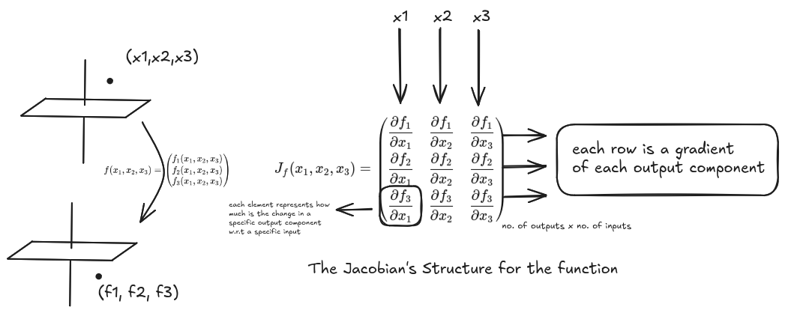
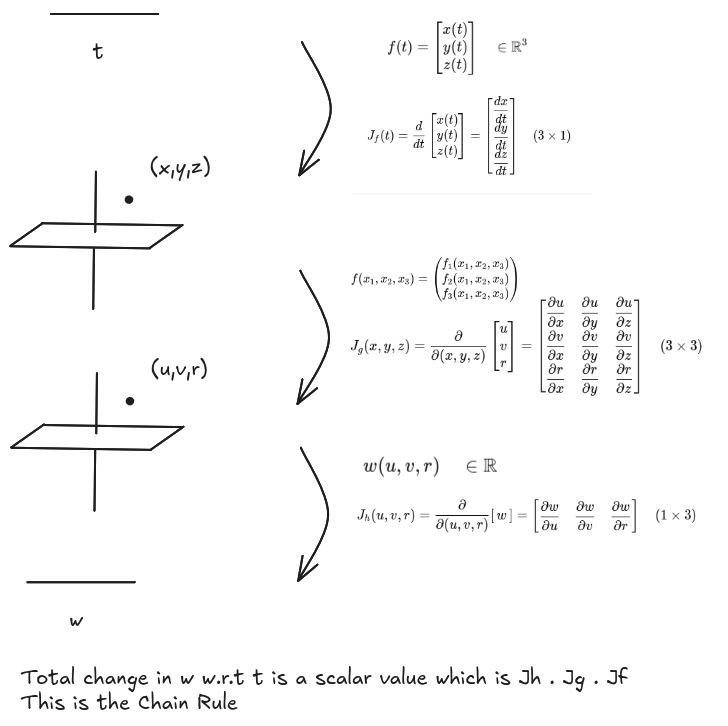
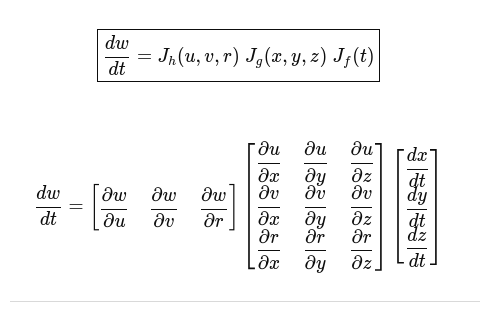

### Jacobian Structure

### Using Jacobian for Chain Rule function composition

### Hessian Structure
## 2. This is a collection of questions to solidify understanding of the Gradient and the Jacobian

### 2.1 Functions and Shapes

#### 2.1.1 What is the difference between a scalar-valued function, a vector-valued function, and a function that maps vectors to vectors? Give a concrete example of each.

A scalar-valued function (often just called a "function") takes one or more variables as input and returns a single real number (a scalar).

Example of a sclar-valued function:

$$
\mathbf{f}(x, y) = x^2 + y^2
$$

A vector-valued function takes a single scalar (or sometimes a vector) as an input and returns a vector. This is most commonly used to describe a path or curve through space over time.
Example of a vector-valued function:

$$
\mathbf{r}(t) = \langle x(t),\, y(t),\, z(t) \rangle
$$

#### 2.1.2 If a function maps $\mathbb{R}^n \to \mathbb{R}$, what does its derivative represent geometrically, and why can it be written as a vector?
If a function maps a space of n variables to a single scalar, it is a scalar valued function. Geometrically, it's derivative is the vector where the output increases the most. Essentially, it tells how much each dimension in the n-space contribute to the output. 

#### 2.1.3 If a function maps $\mathbb{R}^n \to \mathbb{R}^m$, why can its derivative no longer be a single vector? What structure replaces it?

